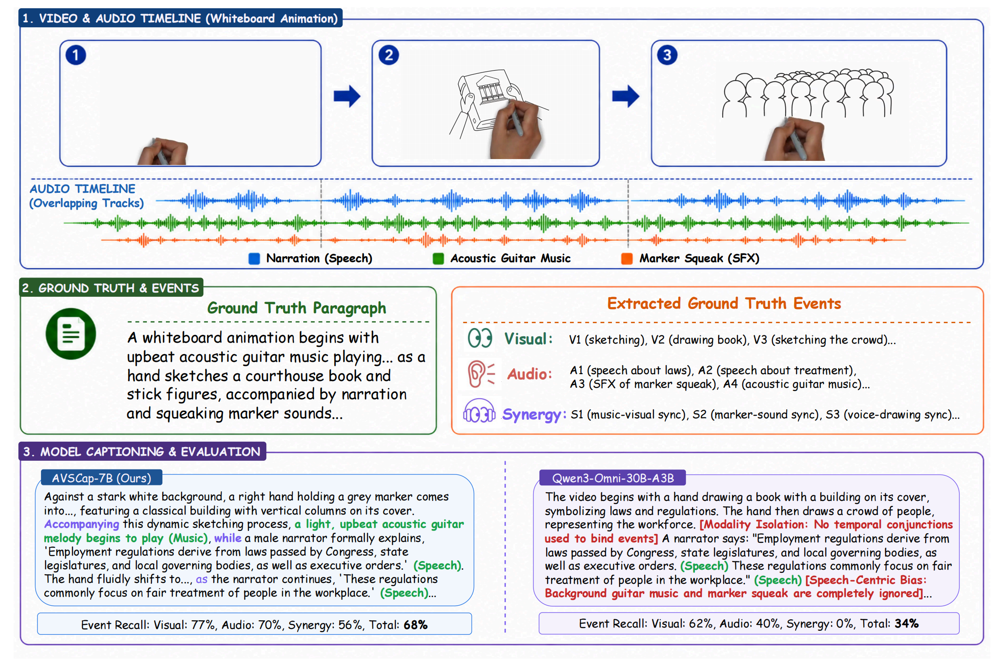

# **AVSCap: Orchestrating Audio-Visual Synergy for Omni-modal Video Captioning**

[](https://nju-link.github.io/AVSCap/)
&nbsp;
[](https://arxiv.org/abs/2607.12820)
&nbsp;
[](https://huggingface.co/datasets/NJU-LINK/AVSCapBench)

## Overview

**AVSCap** targets omni-modal video captioning, where a caption should not only describe visual content and transcribe speech, but also capture music, sound effects, and their temporal or causal relations with visual events.

<p align="center">
  
</p>

---

## Quick Start

### Clone

```bash
git clone https://github.com/NJU-LINK/AVSCap.git
cd AVSCap
```

### Installation

```bash
conda create -n avscap python=3.12
conda activate avscap
pip install torch torchvision
pip install transformers==4.57.1
pip install accelerate
pip install flash-attn --no-build-isolation
# It's highly recommended to use `[decord]` feature for faster video loading.
pip install qwen-omni-utils[decord] -U
```

### Usage

```python
import torch
from transformers import Qwen2_5OmniForConditionalGeneration, Qwen2_5OmniProcessor
from qwen_omni_utils import process_mm_info

# 1. Configuration
MODEL_ID = "NJU-LINK/AVSCap-7B"
VIDEO_PATH = "example_video.mp4"  # <--- Replace with your video path

MAX_PIXELS = 297920
VIDEO_MAX_PIXELS = 297920

print(f"Processing video: {VIDEO_PATH}")

# 2. Load Model & Processor
print("Loading model...")
model = Qwen2_5OmniForConditionalGeneration.from_pretrained(
    MODEL_ID,
    torch_dtype=torch.bfloat16,
    device_map="cuda",
    attn_implementation="flash_attention_2"
)
processor = Qwen2_5OmniProcessor.from_pretrained(MODEL_ID)
model.disable_talker()

# 3. Construct Conversation
# The prompt encourages detailed audio-visual description.
conversation = [
    {
        "role": "user",
        "content": [
            {
                "type": "text",
                "text": "Please describe all the information in the video without sparing every detail in it. As you describe, you should alsodescribe as much of the information in the audio as possible, and pay attention to the synchronization between the audio and video descriptions."
            },
            {
                "type": "video",
                "video": VIDEO_PATH,
                "max_pixels": MAX_PIXELS,
                "max_frames": 160,
                "fps": 1.0,
                "video_max_pixels": VIDEO_MAX_PIXELS
            }
        ],
    },
]

# 4. Process Inputs
print("Processing inputs...")
text = processor.apply_chat_template(conversation, add_generation_prompt=True, tokenize=False)

audios, images, videos = process_mm_info(conversation, use_audio_in_video=True)

inputs = processor(
    text=text,
    audio=audios,
    images=images,
    videos=videos,
    return_tensors="pt",
    padding=True,
    use_audio_in_video=True
)
inputs = inputs.to(model.device).to(model.dtype)

# 5. Generate Description
print("Generating description...")
with torch.inference_mode():
    text_ids = model.generate(
        **inputs,
        use_audio_in_video=True,
        return_audio=False,
        thinker_max_new_tokens=4096,
        talker_max_tokens=4096
    )

response = processor.decode(text_ids[0][inputs.input_ids[0].size(0):], skip_special_tokens=True)

print("\n" + "="*50)
print("VIDEO DESCRIPTION:")
print("="*50)
print(response)
print("="*50)
```

---

## Evaluation on AVSCapBench

Download AVSCapBench from Hugging Face:

```bash
hf download NJU-LINK/AVSCapBench --repo-type dataset --local-dir AVSCapBench
```

Prepare model captions as JSONL files:

```text
model_captions/
  YourModel.jsonl
```

Each line should contain:

```json
{"video_id": "1.mp4", "output": "model caption text"}
```

Run event-recall evaluation:

```bash
export JUDGE_API_KEY=YOUR_KEY
export JUDGE_MODEL=gemini-3.1-pro

python evaluation/evaluate_avscapbench.py \
  --gt AVSCapBench/metadata/OmniCaption.json \
  --videos-dir AVSCapBench/videos \
  --captions-dir model_captions \
  --output-dir results/eval \
  --run-evals
```

---

## TODOs

We will release the model and training set as soon as possible.

---

## License

Our dataset is under the CC-BY-NC-SA-4.0 license.

---

## Citation

```bibtex
@article{wang2026avscap,
  title   = {AVSCap: Orchestrating Audio-Visual Synergy for Omni-modal Video Captioning},
  author  = {Wang, Yanghai and Wang, Jiahao and Tang, Jiafu and Zhang, Yuanxing and Cao, Zhe and Bian, Hanyan and Zhang, Zijie and Luo, Weiliang and Pan, Zhiyu and Dong, Zixuan and Liu, Jiaheng and Zhang, Zhaoxiang},
  journal = {arXiv preprint arXiv:2607.12820},
  year    = {2026}
}
```
